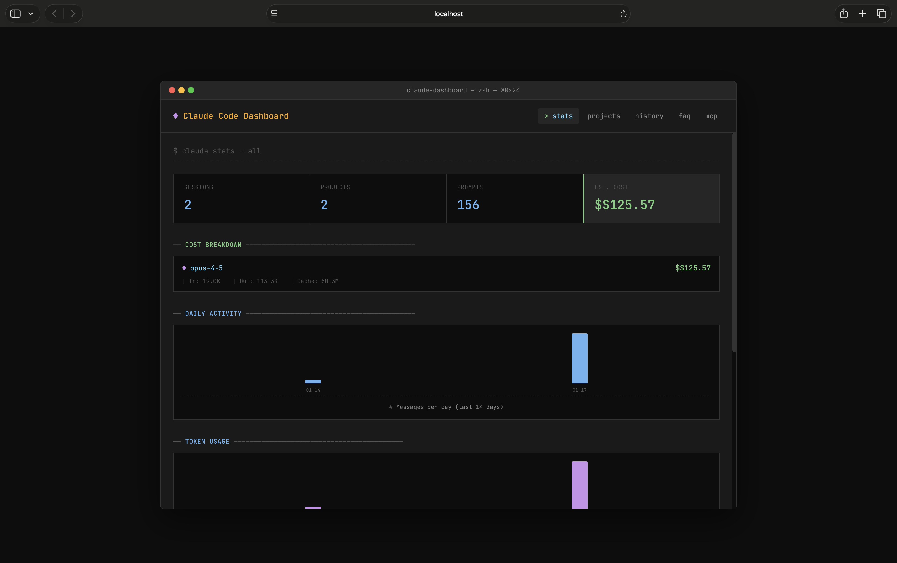
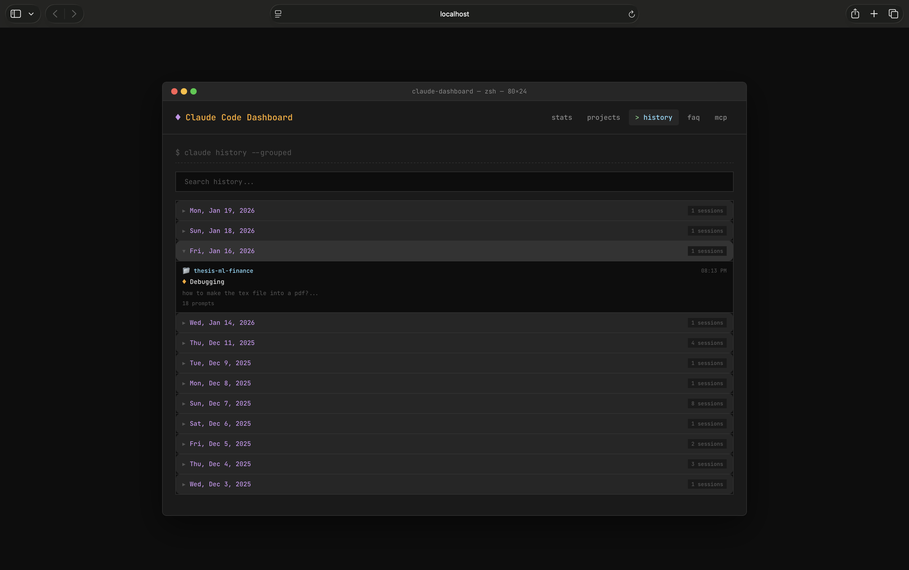
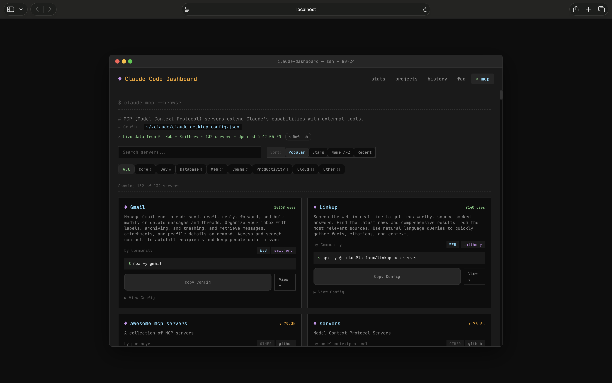

# ClaudeBuddy

Your friendly companion dashboard for [Claude Code](https://claude.ai/code) - view your sessions, conversation history, usage stats, and helpful resources all in one place.



## Features

- **Stats Overview** - See your total sessions, messages, token usage, and estimated API costs at a glance
- **Usage Charts** - Visualize your daily activity and token consumption over time
- **Projects View** - Browse all your Claude Code projects with session history
- **Conversation History** - Search and view past conversations, grouped by date
- **Export Conversations** - Export any conversation to Markdown with one click
- **FAQ & Help** - Quick reference for keyboard shortcuts, slash commands, and tips
- **MCP Browser** - Discover and install Model Context Protocol servers
- **Terminal Aesthetic** - Beautiful CLI-inspired dark theme with JetBrains Mono font
- **Auto-Open** - Automatically opens when you start Claude Code (optional)
- **Responsive Design** - Works on desktop, tablet, and mobile

## Requirements

- Node.js 18 or higher
- Claude Code installed and used at least once (creates `~/.claude` directory)

## Installation

```bash
# Clone the repository
git clone https://github.com/yourusername/claudebuddy.git
cd claudebuddy

# Install dependencies (this also builds the frontend)
npm install

# Start ClaudeBuddy
npm start
```

Then open http://localhost:3456 in your browser.

## Auto-Open with Claude Code

Want ClaudeBuddy to automatically open every time you start Claude Code? Add this alias to your shell config (`~/.zshrc` or `~/.bashrc`):

```bash
# ClaudeBuddy - auto-open on claude start
alias claude='(/path/to/claudebuddy/scripts/open-dashboard.sh &) && command claude'
```

Replace `/path/to/claudebuddy` with your actual installation path.

Then reload your shell:
```bash
source ~/.zshrc  # or source ~/.bashrc
```

Now just run `claude` as usual - ClaudeBuddy will open automatically alongside Claude Code.

## Usage

### Start ClaudeBuddy Manually

```bash
npm start
```

ClaudeBuddy runs on `http://localhost:3456` by default.

### Development Mode

For development with hot reload:

```bash
npm run dev
```

This starts both the server and Vite dev server concurrently.

## Configuration

ClaudeBuddy reads data from your local Claude Code installation at `~/.claude/`. No configuration is required - it automatically detects your projects and sessions.

### Changing the Port

Set the `PORT` environment variable:

```bash
PORT=8080 npm start
```

## How It Works

Claude Code stores your session data locally in `~/.claude/`:
- `projects/` - Contains JSONL files for each coding session
- `stats-cache.json` - Aggregated usage statistics
- `.claude.json` - Configuration settings

ClaudeBuddy reads these files (read-only) and presents them in a friendly UI. Your data never leaves your machine.

## Screenshots

<details>
<summary>Stats</summary>


</details>

<details>
<summary>Projects</summary>


</details>

<details>
<summary>History</summary>


</details>

<details>
<summary>MCP Browser</summary>


</details>

## Tech Stack

- **Frontend**: React + Vite
- **Backend**: Express.js
- **Styling**: Plain CSS with CSS variables
- **Font**: JetBrains Mono

## Contributing

Contributions are welcome! Please feel free to submit a Pull Request.

1. Fork the repository
2. Create your feature branch (`git checkout -b feature/amazing-feature`)
3. Commit your changes (`git commit -m 'Add some amazing feature'`)
4. Push to the branch (`git push origin feature/amazing-feature`)
5. Open a Pull Request

## License

MIT License - see [LICENSE](LICENSE) for details.

## Acknowledgments

- [Claude Code](https://claude.ai/code) by Anthropic
- [JetBrains Mono](https://www.jetbrains.com/lp/mono/) font
- The Claude Code community

## Disclaimer

This is an unofficial community project and is not affiliated with or endorsed by Anthropic. Claude and Claude Code are trademarks of Anthropic.

---

Made with Claude Code
